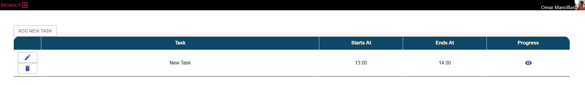
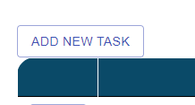
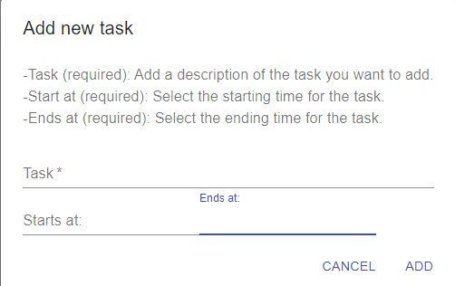
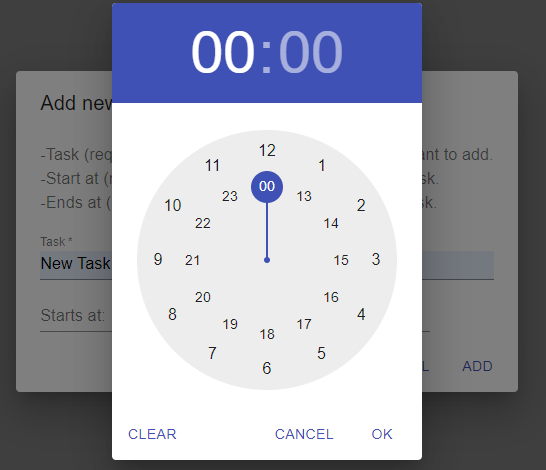
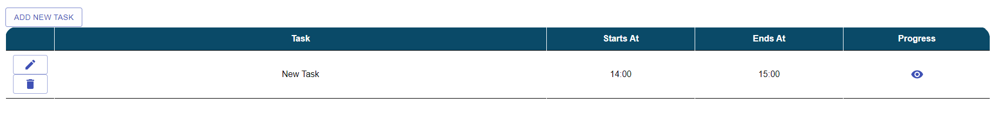
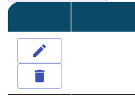
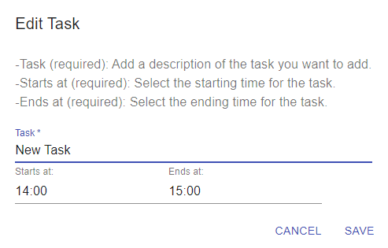
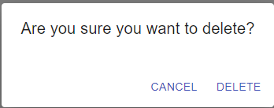
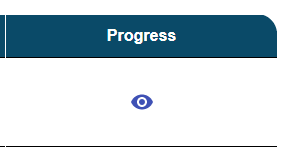
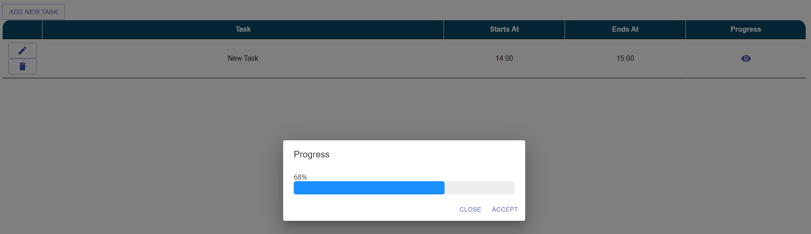

.. TaskScheduler documentation master file, created by
   sphinx-quickstart on Tue Jul 20 13:05:47 2021.
   You can adapt this file completely to your liking, but it should at least
   contain the root `toctree` directive.

Welcome to TaskScheduler's documentation!
=========================================

.. toctree::
   :maxdepth: 4
   :caption: Contents:

About
==================
This app was created for those of us who struggle to organize our tasks and be able to have a better visualization of what we are doing and how much time we are spending on each task.

TaskSchedulerApp is a simple app where you can add as many tasks as you want, a starting time and an ending time. Also, we have a functionality that allows us to check the progress of each task based on the starting/ending time.

How to use the app
==================
You can start adding a new task by clicking the "Add New Task" button.

A dialog will show, where you can fill the information for the new task.
   * New Task
   * Starts at
   * Ends at

When you click on the “Starts at” or “Ends at” field, a time picker will pop up, and with this you can set the starting time for your task.

   
Once everything is set, now just click the "ADD" button on the "New Task" dialog. And your new task is created.

Additionally, on each entry, we have the "Edit" and "Delete" buttons, the "Edit" button opens a dialog with the same structure as the "New Task" dialog, but with the information of the task already there. In this dialog we can change whatever we want from the task and then click "Save".

The "Delete" button, just opens a dialog where it asks us if we really want to delete that task.

The last functionality is the "Check Progress" button which opens a dialog showing a progress bar based on the elapsed time for that task.

Notes
==================

The project is still in progress; thus, it has not been deployed to a hosting service.

`Check the project here <https://github.com/OmarMancillas/TaskSchedulerApp/>`_
==============================================================================